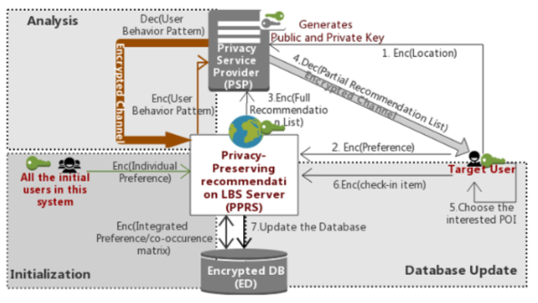
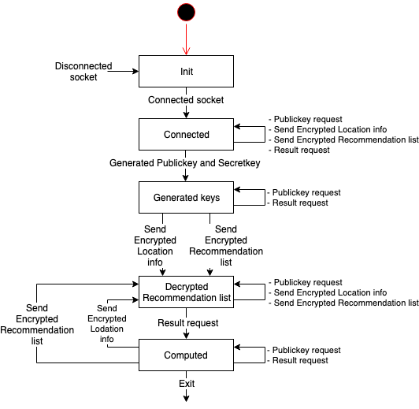
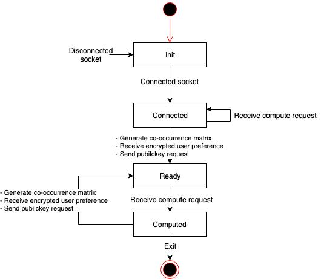

# Privacy-Preserving Recommendation for Location-Based Services with Fully Homomorphic Encryption

Implementation of the protocol with the functions:
1. Compute aggregate information concerning user behavior patterns homomorphically while maintaining the privacy of individual users. 
2. Encrypted database update.



# Prerequisites
* CentOS 7.3
* Linux Kernel 3.10.0
* glibc 2.17
* g++ 4.8.5
* cmake >=2.8
* [HElib](https://github.com/shaih/HElib)
* doxygen (If you generate a document)

# Building
1. Build and install [HElib](https://github.com/shaih/HElib) according to Option 1 in INSTALL.md.
2. Run following command to build the library.
    ```sh
    $ mkdir build && cd build
    $ cmake ..
    $ make
    ```

* Generated files

| File | Content |
|:---|:---|
| lbsr/lbsr_psp/liblbsr_psp.so | PSP library |
| lbsr/lbsr_pprs/liblbsr_pprs.so | PPRS library |
| lbsr/lbsr_client/liblbsr_client.so | Client(Target User) library |
| stdsc/stdsc/libstdsc.so | stdsc library |
| demo/psp/psp | PSP demo app |
| demo/pprs/pprs | PPRS demo app |
| demo/client/client | Client(Target User) demo app |

# API Reference
* Run following command to build the documentation.
    ```sh
    $ cd doc && doxygen
    ```
* see `doc/html/index.html`

# Demo
Demo app consists of three processes: PSP, PPRS and Client(Target User). These processes communicate as shown in the following figure.


## PSP demo app
* Behavior
    * If the `-g` option is specified, PSP generates a Public Key file with the file name specified by` pubkey_filename` and a Secret Key file with file name specified by `seckey_filename`. (Fig: (1))
    * PSP receives public key request from Client, then return the public key to Client. (Fig: (2))
    * PSP receives encryped location info from Client. (Fig: (4'))
    * PSP receives result request from Client, then decrypt recommendation list and retrieve location info and return the result to Clinet. (Fig: (8))
* Usage
    ```sh
    Usage: ./psp [-p pubkey_filename] [-s seckey_filename] [-g]
    ```
    * -p pubkey_filename : file path of public key file (REQUIRED)
    * -s seckey_filename : file path of secret key file (REQUIRED)
    * -g : if this option is specified, it generates a public Key file and a secret Key file. (OPTINAL)
* State Transition Diagram
  * 

## PPRS demo app
* Behavior
    * PPRS sends public key request to PSP, then receives the public key from PSP and save it named `pubkey.txt`. (Fig: (2'))
    * PPRS generates a co-occurrence matrix file named `enc_cooccurrence.txt`. (Fig: (3'))
    * PPRS receives encryped user preference from Client and save it named 'enc_preference.txt`. (Fig: (4))
    * PPRS receives compute request from Client, then compute recommendation and send the result to PSP. (Fig: (5)(6))
* Usage
    ```sh
    Usage: ./pprs [-i input_filename]
    ```
    * -i input_filename : file path of input data (REQUIRED)
* State Transition Diagram
  * 

## Client demo app
* Behavior
    * Client sends public key request to PSP, then receives the public key from PSP and save it named `pubkey.txt`. (Fig: (2))
    * Client encrypts the user preference specified by `input_filename`, then Client sends encrypted data to PPRS. (Fig: (3)(4))
    * Client sends encrypted location info to PSP. (Fig: (4'))
    * Client sends result request to PSP, then receives the result from PSP and write it to stdout. (Fig: (8))
* Usage
    ```sh
    Usage: ./querier [-i input_filename]
    ```
    * -i input_filename : file path of input data (REQUIRED)    

# License
Copyright 2018 Yamana Laboratory, Waseda University
Supported by JST CREST Grant Number JPMJCR1503, Japan.

Licensed under the Apache License, Version 2.0 (the "License");
you may not use this file except in compliance with the License.
You may obtain a copy of the License at

http://www.apache.org/licenses/LICENSE-2.0

Unless required by applicable law or agreed to in writing, software
distributed under the License is distributed on an "AS IS" BASIS,
WITHOUT WARRANTIES OR CONDITIONS OF ANY KIND, either express or implied.
See the License for the specific language governing permissions and
limitations under the License.
